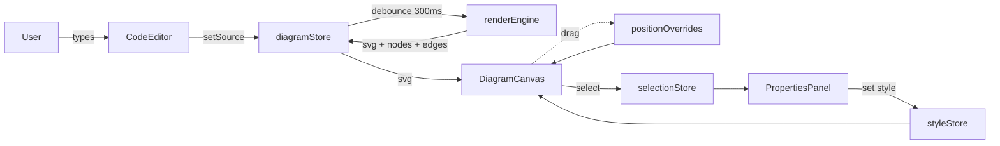

# Architecture

MermaidFlow is built as a small collection of **features**, each owning its own
components, hooks, and services. Cross-feature communication happens exclusively
through **Zustand stores** — never by importing across feature boundaries.

## Module map

```
src/
├── app/                      # App shell, providers, layout
├── stores/                   # Zustand stores (single source of truth)
│   ├── diagramStore.ts       # Source, rendered SVG, node meta, position overrides
│   ├── selectionStore.ts     # Selected node/edge IDs
│   ├── styleStore.ts         # Per-element style overrides, annotations
│   ├── uiStore.ts            # Theme, viewport, toasts, panel state
│   └── historyStore.ts       # Undo/redo snapshots
├── features/
│   ├── editor/               # CodeMirror + toolbar + syntax error panel
│   ├── canvas/               # Mermaid render pipeline + interaction
│   │   ├── services/
│   │   │   ├── renderEngine.ts      # source -> annotated SVG
│   │   │   └── svgManipulator.ts    # ID annotation + bbox extraction
│   │   └── hooks/
│   │       ├── useMermaidRender.ts  # debounced render
│   │       ├── useCanvasInteraction # pan + zoom
│   │       └── useNodeDrag.ts       # drag + live edge reroute
│   ├── file-io/              # Drag-drop, .mermaidflow serialise/parse, PNG/SVG export, autosave
│   ├── styling/              # Properties panel + preset chips
│   └── sharing/              # Deflate + base64url URL hash encoding
└── shared/                   # Components, hooks, types, utils, constants
```

## Data flow



## Rendering pipeline

1. Editor writes to `diagramStore.source`.
2. `useMermaidRender` debounces the change (300ms) and calls `renderMermaid`.
3. Mermaid returns raw SVG. `svgManipulator` walks it and:
   - assigns `data-node-id` on every `<g class="node">` (mapped from
     `flowchart-A-0` → `A`),
   - assigns `data-edge-id` on every edge path.
4. `DiagramCanvas` writes the annotated SVG into the DOM, then applies:
   - position overrides (`transform="translate(x,y)"`),
   - style overrides (`fill`, `stroke`, `stroke-width`, etc.),
   - selection classes.
5. `useNodeDrag` listens on the SVG host for pointer events on
   `[data-node-id]` groups, updates the transform live, and re-routes any
   incident edges by rewriting `path[data-edge-id]`'s `d` attribute.

## Why Zustand?

- Every feature already needs a slice of shared state (source, selection,
  overrides), and prop drilling five levels deep is prohibited by the project
  principles.
- Stores are plain modules — trivially unit-testable and mockable.
- No React context boilerplate; components subscribe only to the slices they
  read (via selector functions).

## Extension points

- **Custom Mermaid dialects** — replace `mermaidLanguage.ts` with a full Lezer
  grammar, no other changes required.
- **Web Worker parsing** — swap `renderEngine.ts`'s implementation for a
  postMessage bridge; call sites unchanged.
- **Advanced layouts** — inject a dagre/ELK pass between `renderEngine` and
  the store; export a `PositionOverride` map keyed by `data-node-id`.
- **Extra export formats** — drop a new service in `features/file-io/services/`
  and expose it through the toolbar.
