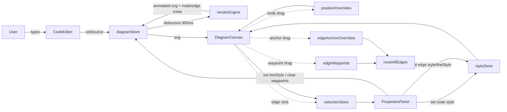

# Architecture

MermaidFlow is organised as a small collection of **features**, each owning its
own components, hooks, and services. Cross-feature communication happens
exclusively through **Zustand stores** — features never import each other's
internals.

## Module map

```
src/
├── app/                            # App shell, providers, layout
├── stores/                         # Zustand stores (single source of truth)
│   ├── diagramStore.ts             # Source, rendered SVG, node meta, position overrides
│   ├── selectionStore.ts           # Selected node/edge IDs
│   ├── styleStore.ts               # Per-element style overrides, annotations
│   ├── uiStore.ts                  # Theme, viewport, toasts, panel state
│   └── historyStore.ts             # Undo/redo snapshots
├── features/
│   ├── editor/                     # CodeMirror + toolbar + syntax error panel
│   ├── canvas/                     # Mermaid render pipeline + interaction
│   │   ├── components/             # DiagramCanvas, CanvasControls
│   │   ├── hooks/                  # useMermaidRender, useCanvasInteraction, useNodeDrag
│   │   └── services/               # See "Canvas services" below
│   ├── file-io/                    # Drag-drop, .mermaidflow serialise/parse, PNG/SVG export, autosave
│   ├── styling/                    # Properties panel + preset chips
│   └── sharing/                    # Deflate + base64url URL hash encoding
└── shared/                         # Components, hooks, types, utils, constants
```

## Canvas services

The canvas is the most substantive piece of the app: it wraps Mermaid, injects
interactive metadata, keeps edges anchored to their nodes across drags, and
grows the viewBox as content moves. To keep files small and testable, the
pipeline is decomposed into layers, each importable through the
`services/index.ts` barrel.

```
                         ┌───────────────────────────────────────────────┐
   DiagramCanvas ▶ ─────▶│  services/index.ts (barrel, re-exports below) │
   useNodeDrag   ▶ ─────▶└───────────────────────────────────────────────┘
                                          │
     ┌───────────────┬────────────────────┼────────────────────┬─────────────────┐
     ▼               ▼                    ▼                    ▼                 ▼
 renderEngine   svgManipulator       routing/             viewbox.ts         svg/
     │               │                    │                    │                 │
   Mermaid       annotates            routeAllEdges       expandViewBox    parseTranslate
    → svg         data-node-id,       + fallback           to fit all       groupBBox
                  data-edge-*,        endpoint infer       node rects       localBBox
                  data-edge-id                                              pathEndpoints
                  on labels           anchors ─┐                            pathMidpoint
                                      paths ───┤ (pure geometry)
                                      endpointInference ─┘
```

### `services/svg/` — DOM primitives

Only these modules touch raw SVG attributes. They read **static**
attributes (never `getBBox()`, which is broken in jsdom and forces layout)
and return typed `BBox` / `Point` values from `@/shared/types/diagram`.

| File              | Responsibility |
| ----------------- | -------------- |
| `transforms.ts`   | Parse `translate(x, y)` attributes. |
| `shapeBBox.ts`    | Compute the root-space bbox of a Mermaid node — composing the group's `translate` with the shape child's own `translate` (crucial for diamonds/hexagons whose polygon carries its own transform to center itself). Also provides `fallbackBBox` when a shape can't be measured. |
| `pathGeometry.ts` | Extract endpoints from a path's `d` attribute; compute a midpoint with a `getTotalLength`/`getPointAtLength` fast path and a jsdom-safe analytic fallback. |

### `services/routing/` — edge (re)routing

Idempotent path rewriting. Called on every render and every drag frame.

| File                    | Responsibility |
| ----------------------- | -------------- |
| `anchors.ts`            | Pick a side-midpoint on a rect facing a target center ("Manhattan closest-side"). |
| `pathFormat.ts`         | Numeric formatter (`fmt`) and bend-length clamp (`bendFor`) shared by every emitter — one source of truth for path-string precision. |
| `paths.ts`              | Base emitters only: `bezierPath`, `straightPath`, `orthogonalPath`. UI-agnostic pure functions. |
| `bezierChain.ts`        | Multi-waypoint C1-continuous chained cubic Béziers (`waypointBezierPath`) used when the user drops one or more control points onto an edge. |
| `selfLoop.ts`           | Kidney-shaped self-loop paths (`D --> D`), with an optional waypoint override that rotates the loop to any side of the node and passes exactly through the drag point. |
| `endpointInference.ts`  | Given a path with unknown source/target, find the nearest node to each endpoint (fallback when id decoding fails). |
| `routeEdges.ts`         | Orchestrator: collect node rects, resolve endpoints, emit path (routing through the emitter that matches `EdgeLineStyle` / self-loop / waypoint state), reposition edge labels. |

### `services/edgeIds.ts` — Mermaid id decoding

Pure string helpers that decode Mermaid's node/edge id conventions:

- `flowchart-<user-id>-<counter>` → `<user-id>`
- `L-<source>-<target>-<counter>` → `{ source, target }`

Handles the ambiguity that arises when user ids themselves contain the
separator character by testing every split against a set of known ids.

### `services/viewbox.ts`

Grows the SVG's `viewBox` and inline `width`/`height` to contain every
annotated node (with padding). The only module that mutates the SVG root's
sizing.

### `services/svgManipulator.ts`

Thin orchestration layer that stitches the above together:

1. Annotate every `<g class="node">` with `data-node-id`.
2. Annotate every edge path with `data-edge-id` + `data-edge-source/target`
   (using `edgeIds`).
3. Positionally tag every `g.edgeLabel` with the corresponding edge id
   (Mermaid emits them in the same order as the edge paths).
4. Run an initial `routeAllEdges` + `expandViewBoxToFit` pass so the first
   frame is already anchor-correct (no visible jump on first interaction).

Also exports `extractNodes` and `extractEdges` for consumers that want
metadata without re-parsing the DOM (e.g. the diagram store).

### `services/edgeRouter.ts`

Backwards-compatible barrel that re-exports the historically public router
surface (`routeAllEdges`, `nodeRect`, `anchorOn`, `bezierPath`,
`waypointBezierPath`, `selfLoopPath`, `expandViewBoxToFit`, `RouteOptions`).
New code should import from `services/` (or the narrower sub-barrels)
directly.

### Canvas interaction hooks

Two SVG-touching hooks share the same "read from stores → mutate live DOM"
pattern; they never re-render React during a drag.

| File                | Responsibility |
| ------------------- | -------------- |
| `useNodeDrag.ts`    | Pointer-event lifecycle for node dragging + incident-edge rerouting. |
| `useEdgeDrag.ts`    | Pointer-event lifecycle for waypoint and anchor drags. History commit fires on the first move-that-mutates so undo restores the pre-drag state. |
| `edgeHandles.ts`    | Injects `.mf-edge-handle` circles (waypoint ● + anchor ◯) into the SVG for every selected edge, and re-injects them on every dep change so a full SVG re-render doesn't strand them. |
| `edgeDragUtils.ts`  | Shared drag helpers: `svgPoint` (client → SVG coords via `CTM`), `buildLineStyleMap`, `cssEscape`. |

## Data flow



## Rendering pipeline (end-to-end)

1. `EditorPanel` writes to `diagramStore.source`.
2. `useMermaidRender` debounces the change (~300 ms) and calls
   `renderMermaid(source)`.
3. Mermaid returns raw SVG. `annotateInteractiveElements` walks it, stamps
   `data-*` attributes, and runs the initial routing + viewBox fit.
4. `DiagramCanvas` injects the annotated SVG into the DOM, then applies:
   - position overrides (`transform="translate(x, y)"` on node groups),
   - style overrides (`fill`, `stroke`, `stroke-width`, etc.) — applied to
     **all** shape children so compound shapes (diamonds, etc.) update fully,
   - selection classes (nodes → `.mf-node--selected`, edges →
     `.mf-edge--selected`).
5. `useNodeDrag` listens for pointer events on `[data-node-id]` groups. Each
   pointer-move updates the dragged group's transform, calls `routeAllEdges`
   (with line-style / waypoint / anchor-override maps read from the stores) to
   rewrite the `d` of every incident edge (and reposition edge labels), then
   calls `expandViewBoxToFit`.
6. `useEdgeDrag` listens for pointer events on `.mf-edge-handle` circles
   that are injected into the live SVG by `injectEdgeHandles`. Two kinds:
   - **Waypoint handles** (●) — drag to reshape a curve-mode edge. Persisted
     to `diagramStore.edgeWaypoints`.
   - **Anchor handles** (◯) — drag around a node's perimeter to pin the arrow
     attachment to a specific side. Persisted to
     `diagramStore.edgeAnchorOverrides`.
7. Clicking an edge path selects it (stored in `selectionStore.selectedEdgeIds`)
   and shows the **Edge Properties** panel.
8. The `↺ Reset All` toolbar button clears all style overrides, position
   overrides, edge waypoints, and anchor overrides simultaneously.

### `routeAllEdges(svg, options?)`

Accepts an optional `RouteOptions` bag:

```ts
interface RouteOptions {
  lineStyles?:      ReadonlyMap<string, EdgeLineStyle>;        // 'curve' | 'straight' | 'orthogonal'
  waypoints?:       ReadonlyMap<string, EdgeWaypoint[]>;       // per-edge control points
  anchorOverrides?: ReadonlyMap<string, { source?, target? }>; // per-edge anchor pins
}
```

All fields are optional — callers that don't need a feature just omit it. The
default (no options) produces the original bezier routing behaviour.

The full pipeline is a straight line: raw text → Mermaid → static-attribute
annotation → interaction. Nothing calls `getBBox()` on the hot path, so drags
stay smooth and the whole service layer runs happily in jsdom (`vitest`).

## Persistence & undo

Two orthogonal state-preservation mechanisms live in `features/file-io/` and
`stores/historyStore.ts` respectively. Both cover the same slice of state so
that a change made through the canvas survives BOTH a page refresh AND an
undo keystroke.

### Autosave (`services/autoSave.ts`)

- Subscribes to `diagramStore`, `styleStore`, and `uiStore` on
  `startAutoSave()`. Every change schedules a debounced save
  (`AUTOSAVE_DEBOUNCE_MS = 500 ms`) into `localStorage['mf.autosave.v1']`.
- **Flush on unload.** `pagehide` and `beforeunload` both invoke
  `flushAutoSave()` which cancels the pending timer and writes synchronously,
  so a mutation made in the last few hundred ms before a refresh is not lost.
- **Restore.** `restoreAutoSave()` reads the snapshot and hydrates all three
  stores. Accepts both `v1.0` (legacy — no edge state) and `v1.1` files;
  missing v1.1 fields default to empty maps.

### History (`stores/historyStore.ts`)

- Each `commit()` captures a 7-field `Snapshot`: `source`,
  `positionOverrides`, `edgeWaypoints`, `edgeAnchorOverrides`, `nodeStyles`,
  `edgeStyles`, `annotations`.
- `apply()` hydrates BOTH `diagramStore` and `styleStore`, so undoing a
  style change and undoing a waypoint drag share the same code path.
- `useEdgeDrag` calls `commit()` on the first move-that-mutates (not on
  pointer-down), matching the "commit last-committed-state, then mutate"
  contract used by `useNodeDrag`.
- The visual-desync bug (dot didn't move on undo) was rooted in
  `DiagramCanvas`'s edge-drag re-injection dep list not fingerprinting
  `edgeWaypoints`. The dep list now includes it, so any store-level change
  (undo, redo, file load, autosave restore) re-injects the handles at the
  new coordinates.

## Design invariants

- **No `getBBox()` in production code.** All geometry is derived from static
  SVG attributes so it works in jsdom and doesn't force layout.
- **Composed transforms.** Every bbox composes group translate + shape
  translate. The polygon-transform bug (diamonds appearing disconnected)
  taught us to never trust `points` in isolation.
- **Idempotent routing.** `routeAllEdges` and `expandViewBoxToFit` may be
  called any number of times per frame; they always produce the same output
  for a given SVG state.
- **Positional edge-label matching.** Mermaid does not put an `id` on
  `g.edgeLabel`, but it emits labels in the same DOM order as edges — the
  only reliable link between the two.
- **Style overrides applied unconditionally.** Every CSS property is set (or
  cleared to `''`) on every shape child — never guarded by a truthy check.
  This is what makes the "reset to original" flow work: setting a property
  to `''` removes the inline override and lets Mermaid's default rules win.
- **Handles live in the live SVG DOM.** Edge handles (waypoint + anchor
  circles) are injected as plain SVG elements alongside the edge paths rather
  than rendered via React, matching the pattern of `useNodeDrag`. A full SVG
  re-render wipes them; `useEdgeDrag` re-injects them on every dep change.

## Why Zustand?

- Every feature already needs a slice of shared state (source, selection,
  overrides), and prop drilling five levels deep is prohibited by the project
  principles.
- Stores are plain modules — trivially unit-testable and mockable.
- No React context boilerplate; components subscribe only to the slices they
  read (via selector functions).

## Extension points

- **Custom Mermaid dialects** — replace `mermaidLanguage.ts` with a full Lezer
  grammar, no other changes required.
- **Web Worker parsing** — swap the implementation of `renderEngine.ts` for a
  postMessage bridge; call sites unchanged.
- **New line styles** — add a case to `routing/paths.ts` and to the
  `EdgeLineStyle` union, then handle it in `routeEdges.ts`'s style switch.
  Anchors, path shapes, and self-loops are already isolated behind their own
  pure functions.
- **Multi-segment waypoints** — `edgeWaypoints` stores an `EdgeWaypoint[]`
  array; the current UI exposes one control point per edge, but the router
  already supports arbitrary waypoint sequences via the `waypointBezierPath`
  builder (chained C1-continuous cubic Béziers).
- **Advanced layouts** — inject a dagre/ELK pass between `renderEngine` and
  the store; export a `PositionOverride` map keyed by `data-node-id`.
- **Extra export formats** — drop a new service in `features/file-io/services/`
  and expose it through the toolbar.

## Testing philosophy

- Every service is pure enough to test in `vitest` + jsdom. The router tests
  include explicit regression cases for the two visually observable bugs
  we've hit — polygon-transform mis-anchoring (diamonds), self-loops, and
  edge-label repositioning.
- Component tests use Testing Library; interaction tests stay at the hook
  level so we don't couple assertions to markup.
- Live browser sanity checks use VS Code's browser tools against the running
  dev server.
